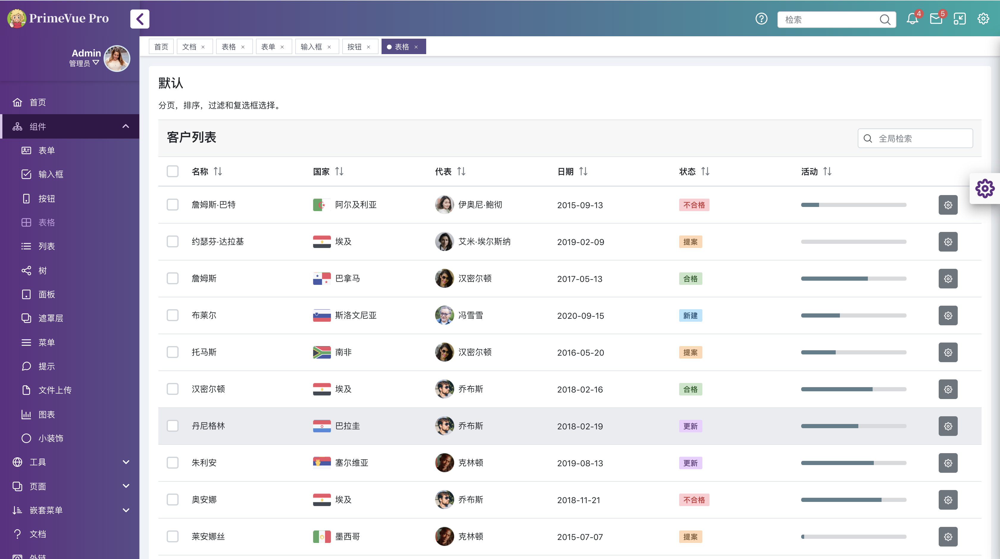

# vite-primevue2-project (原 primevue-pro)

## 简介

vite-primevue2-project 是一个基于 primevue 的前端 UI 模板，参照了 vue-element-admin 实现的 vue admin tempalte, 是一个后台前端解决方案，它基于 vue 和 primevue 实现。它使用了最新的前端技术栈，动态路由，权限验证，提炼了典型的业务模型，提供了丰富的功能组件，它可以帮助你快速搭建企业级中后台产品原型

- 预览地址：https://nangongpo.github.io/vite-primevue2-project/

- 使用文档：https://nangongpo.github.io/vite-primevue2-project/

## 开发注意事项

- 开发环境 node18 + vite5 + vue2.7 + primevue2 + primeflex3.x + primeicons6.x
- 浏览器 chrome >= 49, 预期兼容至 chrome37
- template 中引入 public 资源, 打包时不会追加公共基础路径 base，需手动使用$publicUrl 转换
- vite 引入 primevue2 组件，导致 confirmdialog、confirmpopup、toast 失效，故在 src/plugins 中重写组件
- chart.js 3.x 使用 es6 Proxy, 无法 polyfill, 要兼容 chrome49 以下的版本，请使用其他图表组件

<h1 align="center">vite-primevue2-project</h1>

<div align="center">
  
[vite-primevue2-project](https://nangongpo.github.io/vite-primevue2-project/) 开箱即用的中后台前端/设计解决方案


</div>
<h2 align="center">多种主题模式可选</h2>

<div align="center">


  
  
  
  


</div>

## 使用

### 下载

```bash
$ git clone https://github.com/nangongpo/vite-primevue2-project.git
```

### 安装依赖运行

#### npm

```
 npm install
 npm run serve
```

#### 主题编译

```
 npm run theme
```

### 结构

vite-primevue2-project 包含 2 个主要部分；应用程序布局和资源。src 文件夹中的 App.vue 是包含基本布局模板的主要组件，而所需的资源（如布局的 SASS 结构）则位于 public/resource/layout 文件夹中。

### 模板

主要布局是 App.vue 的模板，它分为几个子组件，例如顶部栏，内容，菜单和页脚。这是 App.vue 组件的模板，该模板 实现了诸如菜单状态，布局模式和其他可配置选项之类的逻辑。

```html
<div :class="containerClass" @click="onDocumentClick">
  <div>
    <AppTopBar
      :topbarMenuActive="topbarMenuActive"
      :profileMode="profileMode"
      :horizontal="layoutMode === 'horizontal'"
      :activeTopbarItem="activeTopbarItem"
      @menubutton-click="onMenuButtonClick"
      @topbar-menubutton-click="onTopbarMenuButtonClick"
      @topbar-item-click="onTopbarItemClick"
    ></AppTopBar>

    <transition name="layout-menu-container">
      <div :class="menuClass" @click="onMenuClick" v-show="isMenuVisible()">
        <div class="menu-scroll-content">
          <AppInlineProfile
            v-if="profileMode === 'inline' && layoutMode !== 'horizontal'"
            @profile-click="onProfileClick"
            :expanded="profileExpanded"
          ></AppInlineProfile>

          <AppMenu
            :model="menu"
            :layoutMode="layoutMode"
            :active="menuActive"
            @menuitem-click="onMenuItemClick"
            @root-menuitem-click="onRootMenuItemClick"
          ></AppMenu>
        </div>
      </div>
    </transition>

    <div class="layout-main">
      <router-view />
    </div>

    <AppConfig
      :layoutMode="layoutMode"
      @layout-change="onLayoutChange"
      :darkMenu="darkMenu"
      @menu-color-change="onMenuColorChange"
      :profileMode="profileMode"
      @profile-mode-change="onProfileModeChange"
      :layout="layout"
      :layouts="layoutColors"
      :layoutSpecialColors="layoutSpecialColors"
      @layout-color-change="onLayoutColorChange"
      :theme="theme"
      :themes="themeColors"
      @theme-change="onThemeChange"
    ></AppConfig>

    <div class="layout-mask"></div>

    <AppFooter />
  </div>
</div>
```

### 菜单

Menu 是基于 PrimeNG MenuModel API 在 AppMenu.vue 文件中定义的单独组件。为了定义菜单项，请导航至 App.vue 文件的数据部分，并使用 menu 属性将您自己的模型定义为嵌套结构。这是演示应用程序中的菜单组件。请注意，菜单对象已绑定到 AppMenu 组件的 model 属性，如下所示。

```javascript

data() {
    return {
        menu : [
				{label: 'Dashboard', icon: 'pi pi-fw pi-home', to:'/'},
				{
					label: 'UI Kit', icon: 'pi pi-fw pi-sitemap',
					items: [
						{label: 'Form Layout', icon: 'pi pi-fw pi-id-card', to: '/formlayout'},
						{label: 'Input', icon: 'pi pi-fw pi-check-square', to: '/input'},
						{label: 'Button', icon: 'pi pi-fw pi-mobile', to: '/button'},
						{label: 'Table', icon: 'pi pi-fw pi-table', to: '/table'},
						{label: 'List', icon: 'pi pi-fw pi-list', to: '/list'},
						{label: 'Tree', icon: 'pi pi-fw pi-share-alt', to: '/tree'},
						{label: 'Panel', icon: 'pi pi-fw pi-tablet', to: '/panel'},
						{label: 'Overlay', icon: 'pi pi-fw pi-clone', to: '/overlay'},
						{label: 'Menu', icon: 'pi pi-fw pi-bars', to: '/menus'},
						{label: 'Message', icon: 'pi pi-fw pi-comment', to: '/messages'},
						{label: 'File', icon: 'pi pi-fw pi-file', to: '/file'},
						{label: 'Chart', icon: 'pi pi-fw pi-chart-bar', to: '/chart'},
						{label: 'Misc', icon: 'pi pi-fw pi-circle-off', to: '/misc'},
					]
				},
				{
					label: "Utilities", icon:'pi pi-fw pi-globe',
					items: [
						{label: 'Display', icon:'pi pi-fw pi-desktop', to:'/display'},
						{label: 'Elevation', icon:'pi pi-fw pi-external-link', to:'/elevation'},
						{label: 'Flexbox', icon:'pi pi-fw pi-directions', to:'/flexbox'},
						{label: 'Icons', icon:'pi pi-fw pi-search', to:'/icons'},
						{label: 'Widgets', icon:'pi pi-fw pi-star-o', to:'/widgets'},
						{label: 'Grid System', icon:'pi pi-fw pi-th-large', to:'/grid'},
						{label: 'Spacing', icon:'pi pi-fw pi-arrow-right', to:'/spacing'},
						{label: 'Typography', icon:'pi pi-fw pi-align-center', to:'/typography'},
						{label: 'Text', icon:'pi pi-fw pi-pencil', to:'/text'},
					]
				},
				{
					label: 'Pages', icon: 'pi pi-fw pi-clone',
					items: [
						{label: 'Crud', icon: 'pi pi-fw pi-pencil', to: '/crud'},
						{label: 'Calendar', icon: 'pi pi-fw pi-calendar-plus', to: '/calendar'},
						{label: 'Landing', icon: 'pi pi-fw pi-user-plus', url: 'resource/pages/landing.html', target: '_blank'},
						{label: 'Login', icon: 'pi pi-fw pi-sign-in', to: '/login'},
						{label: 'Invoice', icon: 'pi pi-fw pi-dollar', to: '/invoice'},
						{label: 'Help', icon: 'pi pi-fw pi-question-circle', to: '/help'},
						{label: 'Error', icon: 'pi pi-fw pi-times-circle', to: '/error'},
						{label: 'Not Found', icon: 'pi pi-fw pi-exclamation-circle', to: '/notfound'},
						{label: 'Access Denied', icon: 'pi pi-fw pi-lock', to: '/access'},
						{label: 'Empty Page', icon: 'pi pi-fw pi-circle-off', to: '/empty'}
					]
				},
				{
					label: 'Menu Hierarchy', icon: 'pi pi-fw pi-sort-amount-down-alt',
					items: [
						{
							label: 'Submenu 1', icon: 'pi pi-fw pi-circle-off',
							items: [
								{
									label: 'Submenu 1.1', icon: 'pi pi-fw pi-circle-off',
									items: [
										{label: 'Submenu 1.1.1', icon: 'pi pi-fw pi-circle-off'},
										{label: 'Submenu 1.1.2', icon: 'pi pi-fw pi-circle-off'},
										{label: 'Submenu 1.1.3', icon: 'pi pi-fw pi-circle-off'},
									]
								},
								{
									label: 'Submenu 1.2', icon: 'pi pi-fw pi-circle-off',
									items: [
										{label: 'Submenu 1.2.1', icon: 'pi pi-fw pi-circle-off'},
										{label: 'Submenu 1.2.2', icon: 'pi pi-fw pi-circle-off'}
									]
								},
							]
						},
						{
							label: 'Submenu 2', icon: 'pi pi-fw pi-circle-off',
							items: [
								{
									label: 'Submenu 2.1', icon: 'pi pi-fw pi-circle-off',
									items: [
										{label: 'Submenu 2.1.1', icon: 'pi pi-fw pi-circle-off'},
										{label: 'Submenu 2.1.2', icon: 'pi pi-fw pi-circle-off'},
										{label: 'Submenu 2.1.3', icon: 'pi pi-fw pi-circle-off'},
									]
								},
								{
									label: 'Submenu 2.2', icon: 'pi pi-fw pi-circle-off',
									items: [
										{label: 'Submenu 2.2.1', icon: 'pi pi-fw pi-circle-off'},
										{label: 'Submenu 2.2.2', icon: 'pi pi-fw pi-circle-off'}
									]
								},
							]
						}
					]
				},
				{label: 'Docs', icon: 'pi pi-fw pi-question', command: () => { window.location = "#/documentation"}},
				{label: 'Buy Now', icon: 'pi pi-fw pi-money-bill', command: () => { window.location = "https://www.primefaces.org/store"}},
		],
    }
}
```

下面列出了 Avalon 的依赖项，需要将其添加到 package.json 中。Avalon 没有直接依赖关系，即使 PrimeVue 组件也是可选的依赖关系。

```xml
{
    "primevue": "^2.0.0",         //optional: PrimeVue components
    "primeicons": "4.0.0",             //optional: Icons
    "primeflex": "1.0.0",              //optional: Grid system
}
```

### 组件主题

Avalon 提供了开箱即用的 15 个 PrimeVue 主题，主题的设置简单，包括位于 public/resource/sass/theme 文件夹内的页面的主题 CSS。

在演示应用程序中，主题 css 文件已添加到 index 页面以启用 themeswitcher 功能，但是由于 VueCLI 支持通过 webpack 进行 SASS 编译，因此您也可以将主题的 sass 导入到 App.vue 中。

```xml
theme-amber
theme-blue
theme-brown
theme-cyan
theme-darkgrey
theme-deeppurple
theme-green
theme-indigo
theme-lightblue
theme-lightgreen
theme-lime
theme-orange
theme-pink
theme-purple
theme-teal
```

可以通过以下步骤开发自定义主题。

选择一个自定义主题名称，例如 theme-myown。
在 public/resource/sass/theme folder 文件夹下创建一个名为 theme-myown.scss 的文件。
定义下面列出的变量，然后导入../sass/theme/\_theme.scss 或../sass/layout-v4/\_theme.scss 文件。
构建 scss 以生成 CSS。
将主题文件包括到您的应用程序中。
这是创建主题所需的变量。

```xml
$primaryLightColor: rgba(38,143,255,.5);
$primaryColor: #007bff;
$primaryDarkColor: #0069d9;
$primaryDarkerColor: #0062cc;
$primaryTextColor: #ffffff;

$highlightBg: $primaryColor;
$highlightTextColor: $primaryTextColor;

@import '../sass/theme/_theme';
```

如果您喜欢手动编译，可以使用一个示例 sass 命令来编译 css。

```xml
sass public/resource/theme/theme-myown.scss:public/resource/theme/theme-myown.css
```

监视模式很方便，可以避免每次进行更改时都进行编译，而请使用以下命令，以便在进行自定义时 sass 可以生成文件。每当对任何 scss 文件进行更改时，都会生成所有 css 文件。

```xml
sass --watch public/assets:public/assets
```

### 布局主题

Avalon 提供了 25 个开箱即用的布局主题，可轻松设置布局主题，包括位于 public/resource/layout/css 文件夹中的页面主题 CSS。

在演示应用程序中，布局 css 文件已添加到 index 页面以启用 themeswitcher 功能，但是由于 VueCLI 支持通过 webpack 进行 SASS 编译，因此您也可以将主题的 sass 导入到 App.vue 中。

布局颜色

```xml
layout-amber
layout-blue
layout-brown
layout-cyan
layout-darkgrey
layout-deeppurple
layout-green
layout-indigo
layout-lightblue
layout-lightgreen
layout-lime
layout-orange
layout-pink
layout-purple
layout-teal
```

主题

```xml
Influenza
Calm
Crimson
Night
Skyline
Sunkist
Little Leaf
Joomla
Firewatch
Suzy
```

可以通过以下步骤开发自定义布局主题。

```xml
选择一个布局名称，例如layout-myown。
在public / assets / layout / css文件夹中创建一个名为public/resource/layout/css 的空文件。
定义下面列出的变量，然后导入 ../../sass/layout/_layout.scss或../../sass/layout-v4/_layout.scss 文件。
编译scs以生成CSS
将主题文件包括到您的应用程序中。
```

这是创建布局所需的变量；

```xml

$topbarLeftGradientStartBgColor:#ff8f00;
$topbarLeftGradientEndBgColor:#ffb300;
$topbarRightGradientStartBgColor:#ff8f00;
$topbarRightGradientEndBgColor:#ffb300;
$topbarTextColor:#ffffff;
$menuGradientStartBgColor:#ffffff;
$menuGradientEndBgColor:#ffffff;
$menuitemHoverBgColor:#e8e8e8;
$menuitemActiveColor: #ff8f00;
$menuitemActiveBgColor:#e8e8e8;
$menuButtonBgColor:#ffffff;
$menuButtonColor:#ff6f00;
$badgeBgColor:#3eb839;
$badgeColor:#ffffff;
$darkMenuGradientStartBgColor:#363a41;
$darkMenuGradientEndBgColor:#363a41;
$darkMenuHoverBgColor:#4a4d54;
$darkMenuMenuitemColor:#ffffff;
$darkMenuMenuitemActiveColor:#ffe57f;
$darkMenuMenuitemActiveBgColor:#282b30;

@import '../../sass/layout/_layout';
```

### 常见的 SASS 变量

如果您想自定义公共变量，可以在 sass/layout 或 sass/theme 文件夹下的\_variables.scss 定义布局的核心变量（例如，字体大小，内边距）。
sass/layout/\_variables.scss

```xml

$fontFamily:-apple-system,BlinkMacSystemFont,"Segoe UI",Roboto,"Helvetica Neue",Arial,sans-serif,"Apple Color Emoji","Segoe UI Emoji","Segoe UI Symbol";
$fontSize:14px;
$textColor:#212529;
$textSecondaryColor:#6c757d;
$borderRadius:4px;
$dividerColor:#dee2e6;
$transitionDuration:.3s;
$disabledBgColor:#eeeeee;
$primeIconFontSize:1.286em;

/* Predefined Colors */
$lightestGray:#f5f5f5;
$lightGray:#cccccc;
$gray:#999999;
$darkGray:#777777;
$white:#ffffff;

$blue:#007bff;
$purple:#9189fd;
$orange:#ffbf79;
$lightBlue:#8dc8ff;
$pink:#f790c8;
$indigo:#6610f2;
$green:#3e9018;
$red:#da2f31;
$orange:#ffb200;
$teal:#599597;
$black:#000000;
$yellow:#ffd644;

$inputInvalidBorderColor:#b94a48;
$inputInvalidBgColor:#ffffff;

$menuHoverBgColor: #f4f4f4;
$bodyBgColor: #EEF2F6;
```

sass/theme/\_variables.scss

```xml
//reused color variables
$shade000:#ffffff;              //surface
$shade100:rgba(0,0,0,.03);      //header background
$shade200:#e9ecef;              //hover background
$shade300:#dee2e6;              //border, divider
$shade400:#ced4da;              //input border
$shade500:#adb5bd;              //unused
$shade600:#6c757d;              //text secondary color
$shade700:#495057;              //input text color
$shade800:#343a40;              //unused
$shade900:#212529;              //text color

//global
$fontFamily:-apple-system, BlinkMacSystemFont, "Segoe UI", Roboto, Helvetica, Arial, sans-serif, "Apple Color Emoji", "Segoe UI Emoji", "Segoe UI Symbol";
$fontSize:1rem;
$fontWeight:normal;
$textColor:$shade900;
$textSecondaryColor:$shade600;
$borderRadius:4px;
$transitionDuration:.15s;
$formElementTransition:background-color $transitionDuration, border-color $transitionDuration, box-shadow $transitionDuration;
$actionIconTransition:box-shadow $transitionDuration;
$listItemTransition:box-shadow $transitionDuration;
$primeIconFontSize:1rem;
$divider:1px solid $shade300;
$inlineSpacing:.5rem;
$disabledOpacity:.65;
$maskBg:rgba(0, 0, 0, 0.4);
$loadingIconFontSize:2rem;
$errorColor:#dc3545;

//scale
$scaleSM:0.875;
$scaleLG:1.25;

//focus
$focusOutlineColor:$primaryLightColor;
$focusOutline:0 none;
$focusOutlineOffset:0;
$focusShadow:0 0 0 0.2rem $focusOutlineColor;

//action icons
$actionIconWidth:2rem;
$actionIconHeight:2rem;
$actionIconBg:transparent;
$actionIconBorder:0 none;
$actionIconColor:$shade600;
$actionIconHoverBg:transparent;
$actionIconHoverBorderColor:transparent;
$actionIconHoverColor:$shade700;
$actionIconBorderRadius:50%;

//input field (e.g. inputtext, spinner, inputmask)
$inputPadding:.5rem .75rem;
$inputTextFontSize:1rem;
$inputBg:$shade000;
$inputTextColor:$shade700;
$inputIconColor:$shade700;
$inputBorder:1px solid $shade400;
$inputHoverBorderColor:$shade400;
$inputFocusBorderColor:$primaryColor;
$inputErrorBorderColor:$errorColor;
$inputPlaceholderTextColor:$shade600;
$inputFilledBg:$shade100;
$inputFilledHoverBg:$shade100;
$inputFilledFocusBg:$shade100;

//input groups
$inputGroupBg:$shade200;
$inputGroupTextColor:$shade700;
$inputGroupAddOnMinWidth:2.357rem;

//input lists (e.g. dropdown, autocomplete, multiselect, orderlist)
$inputListBg:$shade000;
$inputListTextColor:$shade900;
$inputListBorder:$inputBorder;
$inputListPadding:.5rem 0;
$inputListItemPadding:.5rem 1.5rem;
$inputListItemBg:transparent;
$inputListItemTextColor:$shade900;
$inputListItemHoverBg:$shade200;
$inputListItemTextHoverColor:$shade900;
$inputListItemBorder:0 none;
$inputListItemBorderRadius:0;
$inputListItemMargin:0;
$inputListItemFocusShadow:inset 0 0 0 0.15rem $focusOutlineColor;
$inputListHeaderPadding:.75rem 1.5rem;
$inputListHeaderMargin:0;
$inputListHeaderBg:$shade100;
$inputListHeaderTextColor:$shade900;
$inputListHeaderBorder:1px solid $shade300;

//inputs with overlays (e.g. autocomplete, dropdown, multiselect)
$inputOverlayBg:$inputListBg;
$inputOverlayHeaderBg:$inputListHeaderBg;
$inputOverlayBorder:1px solid rgba(0,0,0,.15);
$inputOverlayShadow:none;

//button
$buttonPadding:.5rem .75rem;
$buttonIconOnlyWidth:2.357rem;
$buttonIconOnlyPadding:.5rem 0;
$buttonBg:$primaryColor;
$buttonTextColor:$primaryTextColor;
$buttonBorder:1px solid $primaryColor;
$buttonHoverBg:$primaryDarkColor;
$buttonTextHoverColor:$primaryTextColor;
$buttonHoverBorderColor:$primaryDarkColor;
$buttonActiveBg:$primaryDarkerColor;
$buttonTextActiveColor:$primaryTextColor;
$buttonActiveBorderColor:$primaryDarkerColor;
$raisedButtonShadow:0 3px 1px -2px rgba(0,0,0,.2), 0 2px 2px 0 rgba(0,0,0,.14), 0 1px 5px 0 rgba(0,0,0,.12);
$roundedButtonBorderRadius:2rem;

$textButtonHoverBgOpacity:.04;
$textButtonActiveBgOpacity:.16;
$outlinedButtonBorder:1px solid;
$plainButtonTextColor:$textSecondaryColor;
$plainButtonHoverBgColor:$shade200;
$plainButtonActiveBgColor:$shade300;

$secondaryButtonBg:#6c757d;
$secondaryButtonTextColor:#ffffff;
$secondaryButtonBorder:1px solid #6c757d;
$secondaryButtonHoverBg:#5a6268;
$secondaryButtonTextHoverColor:#ffffff;
$secondaryButtonHoverBorderColor:#5a6268;
$secondaryButtonActiveBg:#545b62;
$secondaryButtonTextActiveColor:#ffffff;
$secondaryButtonActiveBorderColor:#4e555b;
$secondaryButtonFocusShadow:0 0 0 0.2rem rgba(130,138,145,.5);

$infoButtonBg:#17a2b8;
$infoButtonTextColor:#ffffff;
$infoButtonBorder:1px solid #17a2b8;
$infoButtonHoverBg:#138496;
$infoButtonTextHoverColor:#ffffff;
$infoButtonHoverBorderColor:#117a8b;
$infoButtonActiveBg:#138496;
$infoButtonTextActiveColor:#ffffff;
$infoButtonActiveBorderColor:#117a8b;
$infoButtonFocusShadow:0 0 0 0.2rem rgba(58,176,195,.5);

$successButtonBg:#28a745;
$successButtonTextColor:#ffffff;
$successButtonBorder:1px solid #28a745;
$successButtonHoverBg:#218838;
$successButtonTextHoverColor:#ffffff;
$successButtonHoverBorderColor:#1e7e34;
$successButtonActiveBg:#1e7e34;
$successButtonTextActiveColor:#ffffff;
$successButtonActiveBorderColor:#1c7430;
$successButtonFocusShadow:0 0 0 0.2rem rgba(72,180,97,.5);

$warningButtonBg:#ffc107;
$warningButtonTextColor:#212529;
$warningButtonBorder:1px solid #ffc107;
$warningButtonHoverBg:#e0a800;
$warningButtonTextHoverColor:#212529;
$warningButtonHoverBorderColor:#d39e00;
$warningButtonActiveBg:#d39e00;
$warningButtonTextActiveColor:#212529;
$warningButtonActiveBorderColor:#c69500;
$warningButtonFocusShadow:0 0 0 0.2rem rgba(222,170,12,.5);

$helpButtonBg:#6f42c1;
$helpButtonTextColor:#ffffff;
$helpButtonBorder:1px solid #6f42c1;
$helpButtonHoverBg:#633bad;
$helpButtonTextHoverColor:#ffffff;
$helpButtonHoverBorderColor:#58349a;
$helpButtonActiveBg:#58349a;
$helpButtonTextActiveColor:#ffffff;
$helpButtonActiveBorderColor:#4d2e87;
$helpButtonFocusShadow:0 0 0 0.2rem #d3c6ec;

$dangerButtonBg:#dc3545;
$dangerButtonTextColor:#ffffff;
$dangerButtonBorder:1px solid #dc3545;
$dangerButtonHoverBg:#c82333;
$dangerButtonTextHoverColor:#ffffff;
$dangerButtonHoverBorderColor:#bd2130;
$dangerButtonActiveBg:#bd2130;
$dangerButtonTextActiveColor:#ffffff;
$dangerButtonActiveBorderColor:#b21f2d;
$dangerButtonFocusShadow:0 0 0 0.2rem rgba(225,83,97,.5);

$linkButtonColor:$primaryColor;
$linkButtonHoverColor:$primaryDarkColor;
$linkButtonTextHoverDecoration:underline;
$linkButtonFocusShadow:0 0 0 0.2rem $focusOutlineColor;

//checkbox
$checkboxWidth:20px;
$checkboxHeight:20px;
$checkboxBorder:2px solid $shade400;
$checkboxIconFontSize:14px;
$checkboxActiveBorderColor:$primaryColor;
$checkboxActiveBg:$primaryColor;
$checkboxIconActiveColor:$primaryTextColor;
$checkboxActiveHoverBg:$primaryDarkerColor;
$checkboxIconActiveHoverColor:$primaryTextColor;
$checkboxActiveHoverBorderColor:$primaryDarkerColor;

//radiobutton
$radiobuttonWidth:20px;
$radiobuttonHeight:20px;
$radiobuttonBorder:2px solid $shade400;
$radiobuttonIconSize:12px;
$radiobuttonActiveBorderColor:$primaryColor;
$radiobuttonActiveBg:$primaryColor;
$radiobuttonIconActiveColor:$primaryTextColor;
$radiobuttonActiveHoverBg:$primaryDarkerColor;
$radiobuttonIconActiveHoverColor:$primaryTextColor;
$radiobuttonActiveHoverBorderColor:$primaryDarkerColor;

//colorpicker
$colorPickerPreviewWidth:2rem;
$colorPickerPreviewHeight:2rem;
$colorPickerBg:#212529;
$colorPickerBorderColor:#212529;
$colorPickerHandleColor:$shade000;

//togglebutton
$toggleButtonBg:#6c757d;
$toggleButtonBorder:1px solid #6c757d;
$toggleButtonTextColor:#ffffff;
$toggleButtonIconColor:#ffffff;
$toggleButtonHoverBg:#5a6268;
$toggleButtonHoverBorderColor:#545b62;
$toggleButtonTextHoverColor:#ffffff;
$toggleButtonIconHoverColor:#ffffff;
$toggleButtonActiveBg:#545b62;
$toggleButtonActiveBorderColor:#4e555b;
$toggleButtonTextActiveColor:#ffffff;
$toggleButtonIconActiveColor:#ffffff;
$toggleButtonActiveHoverBg:#545b62;
$toggleButtonActiveHoverBorderColor:#4e555b;
$toggleButtonTextActiveHoverColor:#ffffff;
$toggleButtonIconActiveHoverColor:#ffffff;

//inplace
$inplacePadding:$inputPadding;
$inplaceHoverBg:$shade200;
$inplaceTextHoverColor:$shade900;

//rating
$ratingIconFontSize:1.143rem;
$ratingCancelIconColor:#dc3545;
$ratingCancelIconHoverColor:#dc3545;
$ratingStarIconOffColor:$shade700;
$ratingStarIconOnColor:$primaryColor;
$ratingStarIconHoverColor:$primaryColor;

//slider
$sliderBg:$shade200;
$sliderBorder:0 none;
$sliderHorizontalHeight:.286rem;
$sliderVerticalWidth:0.286rem;
$sliderHandleWidth:1.143rem;
$sliderHandleHeight:1.143rem;
$sliderHandleBg:$primaryColor;
$sliderHandleBorder:2px solid $primaryColor;
$sliderHandleBorderRadius:$borderRadius;
$sliderHandleHoverBorderColor:$primaryDarkColor;
$sliderHandleHoverBg:$primaryDarkColor;
$sliderRangeBg:$primaryColor;

//calendar
$calendarTableMargin:.5rem 0;
$calendarPadding:0;
$calendarBg:$shade000;
$calendarInlineBg:$calendarBg;
$calendarTextColor:$shade900;
$calendarBorder:$inputListBorder;
$calendarOverlayBorder:$inputOverlayBorder;

$calendarHeaderPadding:.5rem;
$calendarHeaderBg:$shade100;
$calendarInlineHeaderBg:$calendarBg;
$calendarHeaderBorder:1px solid $shade300;
$calendarHeaderTextColor:$shade900;
$calendarHeaderFontWeight:600;
$calendarHeaderCellPadding:.5rem;

$calendarCellDatePadding:.5rem;
$calendarCellDateWidth:2.5rem;
$calendarCellDateHeight:2.5rem;
$calendarCellDateBorderRadius:$borderRadius;
$calendarCellDateBorder:1px solid transparent;
$calendarCellDateHoverBg:$shade200;
$calendarCellDateTodayBg:$shade400;
$calendarCellDateTodayBorderColor:transparent;
$calendarCellDateTodayTextColor:$shade900;

$calendarButtonBarPadding:1rem 0;
$calendarTimePickerPadding:.5rem;
$calendarTimePickerElementPadding:0 .5rem;
$calendarTimePickerTimeFontSize:1.25rem;

$calendarBreakpoint:769px;
$calendarCellDatePaddingSM:0;

//input switch
$inputSwitchWidth:3rem;
$inputSwitchHeight:1.75rem;
$inputSwitchBorderRadius:$borderRadius;
$inputSwitchHandleWidth:1.250rem;
$inputSwitchHandleHeight:1.250rem;
$inputSwitchHandleBorderRadius:$borderRadius;
$inputSwitchSliderPadding:.25rem;
$inputSwitchSliderOffBg:$shade400;
$inputSwitchHandleOffBg:$shade000;
$inputSwitchSliderOffHoverBg:$shade400;
$inputSwitchSliderOnBg:$primaryColor;
$inputSwitchSliderOnHoverBg:$primaryColor;
$inputSwitchHandleOnBg:$shade000;

//panel
$panelHeaderBorder:1px solid $shade300;
$panelHeaderBg:$shade100;
$panelHeaderTextColor:$shade900;
$panelHeaderFontWeight:600;
$panelHeaderPadding:1rem 1.25rem;
$panelToggleableHeaderPadding:.5rem 1.25rem;

$panelHeaderHoverBg:$shade200;
$panelHeaderHoverBorderColor:$shade300;
$panelHeaderTextHoverColor:$shade900;

$panelContentBorder:1px solid $shade300;
$panelContentBg:$shade000;
$panelContentTextColor:$shade900;
$panelContentPadding:1.25rem;

$panelFooterBorder:1px solid $shade300;
$panelFooterBg:$shade000;
$panelFooterTextColor:$shade900;
$panelFooterPadding:.5rem 1.25rem;

//accordion
$accordionSpacing:0;
$accordionHeaderBorder:$panelHeaderBorder;
$accordionHeaderBg:$panelHeaderBg;
$accordionHeaderTextColor:$panelHeaderTextColor;
$accordionHeaderFontWeight:$panelHeaderFontWeight;
$accordionHeaderPadding:$panelHeaderPadding;

$accordionHeaderHoverBg:$shade200;
$accordionHeaderHoverBorderColor:$shade300;
$accordionHeaderTextHoverColor:$shade900;

$accordionHeaderActiveBg:$panelHeaderBg;
$accordionHeaderActiveBorderColor:$shade300;
$accordionHeaderTextActiveColor:$shade900;

$accordionHeaderActiveHoverBg:$shade200;
$accordionHeaderActiveHoverBorderColor:$shade300;
$accordionHeaderTextActiveHoverColor:$shade900;

$accordionContentBorder:$panelContentBorder;
$accordionContentBg:$panelContentBg;
$accordionContentTextColor:$panelContentTextColor;
$accordionContentPadding:$panelContentPadding;

//tabview
$tabviewNavBorder:1px solid #dee2e6;
$tabviewNavBorderWidth:0 0 1px 0;
$tabviewNavBg:transparent;

$tabviewHeaderSpacing:0;
$tabviewHeaderBorder:solid;
$tabviewHeaderBorderWidth:1px;
$tabviewHeaderBorderColor:$shade000 $shade000 #dee2e6 $shade000;
$tabviewHeaderBg:$shade000;
$tabviewHeaderTextColor:$shade600;
$tabviewHeaderFontWeight:$panelHeaderFontWeight;
$tabviewHeaderPadding:.75rem 1rem;
$tabviewHeaderMargin:0 0 -1px 0;

$tabviewHeaderHoverBg:$shade000;
$tabviewHeaderHoverBorderColor:#dee2e6;
$tabviewHeaderTextHoverColor:$shade600;

$tabviewHeaderActiveBg:$shade000;
$tabviewHeaderActiveBorderColor:#dee2e6 #dee2e6 $shade000 #dee2e6;
$tabviewHeaderTextActiveColor:$shade700;

$tabviewContentBorder:0 none;
$tabviewContentBg:$panelContentBg;
$tabviewContentTextColor:$panelContentTextColor;
$tabviewContentPadding:$panelContentPadding;

//upload
$fileUploadProgressBarHeight:.25rem;
$fileUploadContentPadding:2rem 1rem;

//scrollpanel
$scrollPanelTrackBorder:0 none;
$scrollPanelTrackBg:$shade100;

//card
$cardBodyPadding:1.5rem;
$cardTitleFontSize:1.5rem;
$cardTitleFontWeight:700;
$cardSubTitleFontWeight:400;
$cardSubTitleColor:$shade600;
$cardContentPadding:1rem 0;
$cardFooterPadding:1rem 0 0 0;
$cardShadow:0 2px 1px -1px rgba(0,0,0,.2), 0 1px 1px 0 rgba(0,0,0,.14), 0 1px 3px 0 rgba(0,0,0,.12);

//editor
$editorToolbarBg:$panelHeaderBg;
$editorToolbarBorder:$panelHeaderBorder;
$editorToolbarPadding:$panelHeaderPadding;
$editorToolbarIconColor:$textSecondaryColor;
$editorToolbarIconHoverColor:$textColor;
$editorIconActiveColor:$primaryColor;
$editorContentBorder:$panelContentBorder;
$editorContentBg:$panelContentBg;

//paginator
$paginatorBg:$shade000;
$paginatorTextColor:$primaryColor;
$paginatorBorder:solid $shade300;
$paginatorBorderWidth:0;
$paginatorPadding:.75rem;
$paginatorElementWidth:$buttonIconOnlyWidth;
$paginatorElementHeight:$buttonIconOnlyWidth;
$paginatorElementBg:$shade000;
$paginatorElementBorder:1px solid #dee2e6;
$paginatorElementIconColor:$primaryColor;
$paginatorElementHoverBg:$shade200;
$paginatorElementHoverBorderColor:#dee2e6;
$paginatorElementIconHoverColor:$primaryColor;
$paginatorElementBorderRadius:0;
$paginatorElementMargin:0 0 0 -1px;
$paginatorElementPadding:0;

//table
$tableHeaderBorder:solid #dee2e6;
$tableHeaderBorderWidth:1px 0 0 0;
$tableHeaderBg:$shade100;
$tableHeaderTextColor:$shade900;
$tableHeaderFontWeight:600;
$tableHeaderPadding:1rem 1rem;

$tableHeaderCellPadding:1rem 1rem;
$tableHeaderCellBg:$shade000;
$tableHeaderCellTextColor:$shade900;
$tableHeaderCellFontWeight:600;
$tableHeaderCellBorder:1px solid #dee2e6;
$tableHeaderCellBorderWidth:1px 0 2px 0;
$tableHeaderCellHoverBg:$shade200;
$tableHeaderCellTextHoverColor:$shade900;
$tableHeaderCellIconColor:$shade600;
$tableHeaderCellIconHoverColor:$shade600;
$tableHeaderCellHighlightBg:$shade000;
$tableHeaderCellHighlightTextColor:$primaryColor;
$tableHeaderCellHighlightHoverBg:$shade200;
$tableHeaderCellHighlightTextHoverColor:$primaryColor;
$tableSortableColumnBadgeSize:1.143rem;

$tableBodyRowBg:$shade000;
$tableBodyRowTextColor:$shade900;
$tableBodyRowEvenBg:rgba(0,0,0,.05);
$tableBodyRowHoverBg:$shade200;
$tableBodyRowTextHoverColor:$shade900;
$tableBodyCellBorder:1px solid #dee2e6;
$tableBodyCellBorderWidth:1px 0 0 0;
$tableBodyCellPadding:1rem 1rem;

$tableFooterCellPadding:1rem 1rem;
$tableFooterCellBg:$shade000;
$tableFooterCellTextColor:$shade900;
$tableFooterCellFontWeight:600;
$tableFooterCellBorder:1px solid #dee2e6;
$tableFooterCellBorderWidth:1px 0 1px 0;
$tableResizerHelperBg:$primaryColor;

$tableFooterBorder:1px solid #dee2e6;
$tableFooterBorderWidth:1px 0 1px 0;
$tableFooterBg:$shade100;
$tableFooterTextColor:$shade900;
$tableFooterFontWeight:600;
$tableFooterPadding:1rem 1rem;

$tableCellContentAlignment:left;
$tableTopPaginatorBorderWidth:1px 0 0 0;
$tableBottomPaginatorBorderWidth:1px 0 0 0;

$tableScaleSM:0.5;
$tableScaleLG:1.25;

//dataview
$dataViewContentPadding:0;
$dataViewContentBorder:0 none;
$dataViewListItemBorder:1px solid $shade300;
$dataViewListItemBorderWidth:1px 0 0 0;

//orderlist, picklist
$orderListBreakpoint:769px;
$pickListBreakpoint:769px;

//schedule
$fullCalendarEventBg:$primaryDarkColor;
$fullCalendarEventBorder:1px solid $primaryDarkColor;
$fullCalendarEventTextColor:$primaryTextColor;

//tree
$treeContainerPadding:0.286rem;
$treeNodePadding:0.143rem;
$treeNodeContentPadding:.5rem;
$treeNodeChildrenPadding:0 0 0 1rem;
$treeNodeIconColor:$shade600;

//org chart
$organizationChartConnectorColor:$shade300;

//message
$messageMargin:1rem 0;
$messagePadding:1rem 1.25rem;
$messageBorderWidth:1px;
$messageIconFontSize:1.5rem;
$messageTextFontSize:1rem;
$messageTextFontWeight:500;

//inline message
$inlineMessagePadding:$inputPadding;
$inlineMessageMargin:0;
$inlineMessageIconFontSize:1rem;
$inlineMessageTextFontSize:1rem;
$inlineMessageBorderWidth:0px;

//toast
$toastIconFontSize:2rem;
$toastMessageTextMargin:0 0 0 1rem;
$toastMargin:0 0 1rem 0;
$toastPadding:1rem;
$toastBorderWidth:0;
$toastShadow:0 0.25rem 0.75rem rgba(0,0,0,.1);
$toastOpacity:1;
$toastTitleFontWeight:700;
$toastDetailMargin:$inlineSpacing 0 0 0;

//severities
$infoMessageBg:#cce5ff;
$infoMessageBorder:solid #b8daff;
$infoMessageTextColor:#004085;
$infoMessageIconColor:#004085;
$successMessageBg:#d4edda;
$successMessageBorder:solid #c3e6cb;
$successMessageTextColor:#155724;
$successMessageIconColor:#155724;
$warningMessageBg:#fff3cd;
$warningMessageBorder:solid #ffeeba;
$warningMessageTextColor:#856404;
$warningMessageIconColor:#856404;
$errorMessageBg:#f8d7da;
$errorMessageBorder:solid #f5c6cb;
$errorMessageTextColor:#721c24;
$errorMessageIconColor:#721c24;

//overlays
$overlayContentBorder:1px solid rgba(0,0,0,.2);
$overlayContentBg:$panelContentBg;
$overlayContainerShadow:none;

//dialog
$dialogHeaderBg:$shade000;
$dialogHeaderBorder:1px solid $shade200;
$dialogHeaderTextColor:$shade900;
$dialogHeaderFontWeight:600;
$dialogHeaderFontSize:1.25rem;
$dialogHeaderPadding:1rem;
$dialogContentPadding:1rem;
$dialogFooterBorder:1px solid $shade200;
$dialogFooterPadding:1rem;

//tooltip
$tooltipBg:$shade900;
$tooltipTextColor:$shade000;
$tooltipPadding:$inputPadding;

//steps
$stepsItemBg:transparent;
$stepsItemBorder:1px solid $shade300;
$stepsItemTextColor:$shade600;
$stepsItemNumberWidth:2rem;
$stepsItemNumberHeight:2rem;
$stepsItemNumberFontSize:1.143rem;
$stepsItemNumberColor:$shade900;
$stepsItemNumberBorderRadius:$borderRadius;
$stepsItemActiveFontWeight:600;

//progressbar
$progressBarHeight:1.5rem;
$progressBarBorder:0 none;
$progressBarBg:$shade200;
$progressBarValueBg:$primaryColor;

//menu (e.g. menu, menubar, tieredmenu)
$menuWidth:12.5rem;
$menuBg:$shade000;
$menuBorder:1px solid $shade300;
$menuTextColor:$shade900;
$menuitemPadding:.75rem 1rem;
$menuitemBorderRadius:0;
$menuitemTextColor:$shade900;
$menuitemIconColor:$shade900;
$menuitemTextHoverColor:$shade900;
$menuitemIconHoverColor:$shade900;
$menuitemHoverBg:$shade200;
$menuitemTextActiveColor:$shade900;
$menuitemIconActiveColor:$shade900;
$menuitemActiveBg:$shade200;
$menuitemSubmenuIconFontSize:.875rem;
$submenuHeaderMargin:0;
$submenuHeaderPadding:.75rem 1rem;
$submenuHeaderBg:$shade000;
$submenuHeaderTextColor:$shade900;
$submenuHeaderBorderRadius:0;
$submenuHeaderFontWeight:600;
$overlayMenuBg:$menuBg;
$overlayMenuBorder:1px solid rgba(0,0,0,.15);
$overlayMenuShadow:none;
$verticalMenuPadding:.5rem 0;
$menuSeparatorMargin:.5rem 0;

$breadcrumbPadding:1rem;
$breadcrumbBg:$shade100;
$breadcrumbBorder:0 none;
$breadcrumbItemTextColor:$primaryColor;
$breadcrumbItemIconColor:$primaryColor;
$breadcrumbLastItemTextColor:$shade600;
$breadcrumbLastItemIconColor:$shade600;
$breadcrumbSeparatorColor:$shade600;

$horizontalMenuPadding:.5rem 1rem;
$horizontalMenuBg:$shade100;
$horizontalMenuBorder:0 none;
$horizontalMenuTextColor:rgba(0,0,0,.9);
$horizontalMenuRootMenuitemPadding:1rem;
$horizontalMenuRootMenuitemBorderRadius:$borderRadius;
$horizontalMenuRootMenuitemTextColor:rgba(0,0,0,.5);
$horizontalMenuRootMenuitemIconColor:rgba(0,0,0,.5);
$horizontalMenuRootMenuitemTextHoverColor:rgba(0,0,0,.7);
$horizontalMenuRootMenuitemIconHoverColor:rgba(0,0,0,.7);
$horizontalMenuRootMenuitemHoverBg:transparent;
$horizontalMenuRootMenuitemTextActiveColor:rgba(0,0,0,.9);
$horizontalMenuRootMenuitemIconActiveColor:rgba(0,0,0,.9);
$horizontalMenuRootMenuitemActiveBg:transparent;

//badge and tag
$badgeBg:$primaryColor;
$badgeTextColor:$primaryTextColor;
$badgeMinWidth:1.5rem;
$badgeHeight:1.5rem;
$badgeFontWeight:700;
$badgeFontSize:.75rem;

$tagPadding:.25rem .4rem;

//carousel
$carouselIndicatorsPadding:1rem;
$carouselIndicatorBg:$shade200;
$carouselIndicatorHoverBg:$shade300;
$carouselIndicatorBorderRadius:0;
$carouselIndicatorWidth:2rem;
$carouselIndicatorHeight:.5rem;

//galleria
$galleriaMaskBg:rgba(0,0,0,0.9);
$galleriaCloseIconMargin:.5rem;
$galleriaCloseIconFontSize:2rem;
$galleriaCloseIconBg:transparent;
$galleriaCloseIconColor:$shade100;
$galleriaCloseIconHoverBg:rgba(255,255,255,0.1);
$galleriaCloseIconHoverColor:$shade100;
$galleriaCloseIconWidth:4rem;
$galleriaCloseIconHeight:4rem;
$galleriaCloseIconBorderRadius:$borderRadius;

$galleriaItemNavigatorBg:transparent;
$galleriaItemNavigatorColor:$shade100;
$galleriaItemNavigatorMargin:0 .5rem;
$galleriaItemNavigatorFontSize:2rem;
$galleriaItemNavigatorHoverBg:rgba(255,255,255,0.1);
$galleriaItemNavigatorHoverColor:$shade100;
$galleriaItemNavigatorWidth:4rem;
$galleriaItemNavigatorHeight:4rem;
$galleriaItemNavigatorBorderRadius:$borderRadius;

$galleriaCaptionBg:rgba(0,0,0,.5);
$galleriaCaptionTextColor:$shade100;
$galleriaCaptionPadding:1rem;

$galleriaIndicatorsPadding:1rem;
$galleriaIndicatorBg:$shade200;
$galleriaIndicatorHoverBg:$shade300;
$galleriaIndicatorBorderRadius:$borderRadius;
$galleriaIndicatorWidth:1rem;
$galleriaIndicatorHeight:1rem;
$galleriaIndicatorsBgOnItem:rgba(0,0,0,.5);
$galleriaIndicatorBgOnItem:rgba(255,255,255,.4);
$galleriaIndicatorHoverBgOnItem:rgba(255,255,255,.6);

$galleriaThumbnailContainerBg:rgba(0,0,0,.9);
$galleriaThumbnailContainerPadding:1rem .25rem;
$galleriaThumbnailNavigatorBg:transparent;
$galleriaThumbnailNavigatorColor:$shade100;
$galleriaThumbnailNavigatorHoverBg:rgba(255,255,255,0.1);
$galleriaThumbnailNavigatorHoverColor:$shade100;
$galleriaThumbnailNavigatorBorderRadius:$borderRadius;
$galleriaThumbnailNavigatorWidth:2rem;
$galleriaThumbnailNavigatorHeight:2rem;

:root {
--surface-a:#{$shade000};
--surface-b:#{$shade100};
--surface-c:#{$shade200};
--surface-d:#{$shade300};
--surface-e:#{$shade000};
--surface-f:#{$shade000};
--text-color:#{$shade900};
--text-color-secondary:#{$shade600};
--primary-color:#{$primaryColor};
--primary-color-text:#{$primaryTextColor};
--font-family:#{$fontFamily};
}
```

### 菜单模式

菜单有 4 种模式, 静态 static, 覆盖 overlay, 超薄 slim ，水平 horizontal. App.vue 中的布局容器元素用于通过添加特定类来定义要使用的模式。下面的列表指示每种模式的样式类。

```xml
Static: "layout-wrapper menu-layout-static"
Overlay: "layout-wrapper menu-layout-overlay"
Slim: "layout-wrapper menu-layout-static menu-layout-slim"
Horizontal: "layout-wrapper menu-layout-static menu-layout-horizontal"
```

例如，要创建水平菜单，div 元素应采用以下形式；

```html
<div class="layout-wrapper menu-layout-static menu-layout-horizontal"></div>
```

通过将首选项保留在组件上并使用表达式将其绑定，以便用户可以在模式之间进行切换，也可以将选择留给用户。示例应用程序具有此类用例的示例实现。有关示例，请参阅 App.vue。

### 黑暗菜单

菜单的默认配色方案是浅色，可以通过在菜单容器中添加 layout-menu-dark 样式类来激活替代深色模式。

```html
<div class="layout-menu-container layout-menu-dark"></div>
```

### Profile Modes

用户内容有两个可能的位置，第一个版本是位于主菜单内，第二个选项是顶部菜单。对于 inline 模式，用户头像应放在菜单上方，对于 Overlay 模式，内容应放在顶部栏项目列表中。该示例演示应用程序提供了这两种情况的示例。

### 自定义样式

建议将自定义内容写入 sass/overrides 文件夹下的 scss 文件中，以进行无缝更新，因为这些文件默认情况下为空且从不更新。

```html
_layout_styles: Customizations for the layout _layout_variables: Overrides of
layout variables _theme_styles: Customizations for the theme _theme_variables:
Overrides of theme variables
```

## 参与贡献

我们非常欢迎你的贡献，你可以通过以下方式和我们一起共建 :star2:：

- 在你的公司或个人项目中使用 vite-primevue2-project。
- 通过 [Issue] 报告:bug:或进行咨询。
- 提交 [Pull Request] 改进 Admin 的代码。
<!-- - 加入社群，与小伙伴们一同交流心得。QQ群：xxxx -->
